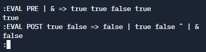
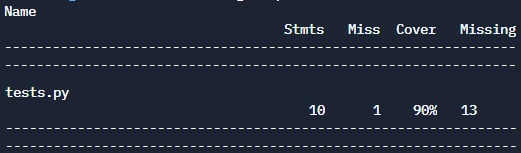

# Manejador de expresiones booleanas
### Pregunta 2
Este programa evalúa y parentiza expresiones booleanas en notación prefija y postfija. Para el manejo de las expresiones se implementó un AST o árbol de sintaxis abstracta que permite evaluar las expresiones y parentizarlas de manera sencilla. Además hay una implementación extra para la evaluación de expresiones booleanas en las funciones evaluarPreorder y evaluarPostorder que se basa en una lista en la que se alojan los valores para su uso posterior al analizar la expresión.

Las operaciones que se permiten en las expresiones son:

    Conjunción: Representada por el símbolo &.
    Disyunción: Representada por el símbolo |.
    Implicación: Representada por el símbolo =>.
    Negación: Representada por el símbolo ˆ.

## ¿Cómo correr?
Al introducir las expresiones se debe indicar si están escritar en notación prefija o postfija, con las palabras PRE o POST. Para evaluar una expresión y mostrar una expresión booleana prefija o postfija parentizada se debe escribir:

    EVAL orden expresion
    MOSTRAR orden expresion
    
En donde orden debe ser POST o PRE.
Se puede salir del programa con la palabra SALIR

    SALIR
    
## Unit Test
El unit test se realizó con el archivo tests.py y se pasaron todos los tests. Obteniendo un 90% de code coverage, que fue calculado con ayuda de la herramienta coverage.py https://coverage.readthedocs.io/en/6.4.1/

    
  
